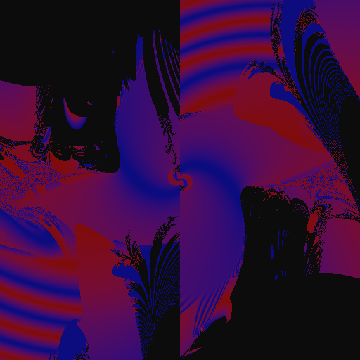

# Cuda Basic Shader



## Requirements

* NVIDIA GPU
* Windows 10
* Cuda ToolKit

## Build and Run

Use `make` to compile or `make run` to compile and run the shader.

Result will be written to "img.bmp"

## Memory Management

The pixel buffer must be stored in a region of memory that is accessible
to both the CPU and GPU.
```c++
char *bmp_buf=NULL;
cudaMallocManaged(&bmp_buf,head.comp_size);
//do something ...
cudaFree(bmp_buf);
```

## Matrix Library (matrix.h)

Cuda doesn't seem to come with a decent shader math library so I'm using 
a modified version of my linear algebra library which can be found here:
https://github.com/stoned-ape/matrix_library

## Saving output as bmp (Windows BitMap)

To create a bmp, all we have to do is construct a header and write it to file,
then write a pixel buffer to the file.  The pixels in the buffer are four bytes
each.  The first byte is the blue component, the second is green, the thrid is
red, and the fourth is unused.

The header looks like this:

```c++
//there must not be any gaps in this struct
#pragma pack(2)
struct bmp_header{
    uint16_t magic; //0x4d42
    uint32_t file_size;
    uint32_t app; //0
    uint32_t offset; //54
    uint32_t info_size; //40
    int32_t width;
    int32_t height;
    uint16_t planes; //1
    uint16_t bits_per_pix; //32 (four bytes)
    uint32_t comp; //0
    uint32_t comp_size; //size in bytes of the pixel buffer (w*h*4)
    uint32_t xres; //0
    uint32_t yres; //0
    uint32_t cols_used; //0
    uint32_t imp_cols; //0
}
```  


## References

* http://www.icl.utk.edu/~mgates3/docs/cuda.html
* https://developer.nvidia.com/blog/even-easier-introduction-cuda/